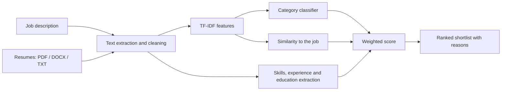

<div align="center">

# AI Resume Screening and Candidate Shortlisting

**Rank resumes against a job description in seconds, and see exactly why each candidate scored the way they did.**


[Live Demo](#live-demo) | [Quick Start](#quick-start) | [How It Works](#how-it-works) | [Limitations](#limitations)

</div>

---

## Overview

Recruiters often receive hundreds of applications for a single opening. Reading them one by one is slow and inconsistent. This project is a machine learning web app that reads resumes, compares them with a job description, and returns a ranked shortlist with a plain-language explanation for every score.

The AI **recommends**. A human recruiter always makes the final decision.

## Key Features

- **Multi-format resume upload:** PDF, DOCX, and TXT, several files at once.
- **Job category prediction:** a TF-IDF text classifier trained on 24 job categories.
- **Explainable ranking:** every candidate shows matched skills, missing skills, and estimated years of experience.
- **Adjustable scoring:** change the weight of each factor from the sidebar and see the ranking update.
- **Exportable results:** download the full ranking as a CSV file.
- **Privacy-minded cleaning:** emails and web links are removed from the text before analysis.

## Live Demo

> Add your deployed link here after publishing: `https://YOUR-APP-NAME.streamlit.app`

<!-- Add a screenshot after deployment:

-->

## How It Works



1. **Read and clean:** text is extracted from each file, lowercased, and stripped of emails and links.
2. **Understand:** a trained model predicts the job category of the resume and of the job description.
3. **Compare:** TF-IDF cosine similarity measures how close each resume is to the job description.
4. **Extract:** known skills, years of experience, and education level are pulled from the text.
5. **Score and rank:** the factors are combined with adjustable weights into a score from 0 to 100.

### Scoring

| Factor | What it measures | Default weight |
|---|---|---|
| Similarity | TF-IDF text similarity between resume and job description | 35% |
| Skills | Share of the job's required skills found in the resume | 35% |
| Category | Whether the resume and the job fall in the same predicted category | 10% |
| Experience | Resume experience compared with the years the job asks for | 10% |
| Education | Whether the education level meets the job requirement | 10% |

Weights are rescaled to add up to 100%, so you can set any values in the sidebar.

## Tech Stack

| Area | Tools |
|---|---|
| Language | Python |
| Machine learning | scikit-learn (TF-IDF, Logistic Regression, Linear SVM) |
| Data | pandas, NumPy |
| File reading | pypdf, python-docx |
| Web app | Streamlit |
| Training environment | Google Colab, kagglehub |

## Project Structure

```
resume-screening-app/
├── app.py                # Streamlit web interface
├── scoring.py            # Cleaning, extraction and ranking logic
├── resume_model.joblib   # Trained model (created in Colab, see below)
├── requirements.txt      # Python dependencies
├── .gitignore
└── README.md
```

Recommended extra folder: `notebooks/` containing the Colab training notebook.

## Quick Start

### Prerequisites

- Python 3.10 or newer
- A trained model file, `resume_model.joblib` (see [Training the Model](#training-the-model))

### 1. Clone the repository

```bash
git clone https://github.com/YOUR-USERNAME/resume-screening-app.git
cd resume-screening-app
```

### 2. Install dependencies

```bash
pip install -r requirements.txt
```

Note: the `scikit-learn` version in `requirements.txt` must match the version used in Colab when the model was saved. If the app fails to load the model, this is the most likely cause.

### 3. Add the trained model

Place `resume_model.joblib` in the project folder, next to `app.py`.

### 4. Run the app

```bash
streamlit run app.py
```

Your browser opens the app, usually at `http://localhost:8501`.

## Using the App

1. Paste a **job description** in the left box.
2. Upload one or more **resumes** (PDF, DOCX, or TXT).
3. Adjust the **scoring weights** and the number of candidates to shortlist in the sidebar.
4. Click **Screen candidates**.
5. Review the ranked table, the score chart, and each candidate's matched and missing skills.
6. Download the ranking as CSV if needed.

Tip: write the required skills explicitly in the job description, for example "Required: accounting, QuickBooks, Excel". The system scores against skills it can find in that text.

## Training the Model

The model is trained in Google Colab on the Kaggle [Resume Dataset](https://www.kaggle.com/datasets/snehaanbhawal/resume-dataset) (about 2,400 resumes across 24 job categories).

1. Open the training notebook in Google Colab.
2. Run the cells in order. The notebook downloads the dataset with `kagglehub`, cleans the data, trains and compares two models, and tests them on unseen resumes.
3. At the end, the notebook saves `resume_model.joblib` and `scoring.py` and downloads them.
4. Copy both files into this project folder.

Training approach: duplicates are removed first, the data is split before any fitting so the test set stays unseen, and TF-IDF is fitted inside a scikit-learn `Pipeline` to avoid data leakage. Logistic Regression and Linear SVM are compared with cross-validation, and the better one is kept.

## Customization

| What you want | Where to change it |
|---|---|
| Add or remove recognised skills | `SKILLS` list in `scoring.py` |
| Change default scoring weights | `WEIGHTS` in `scoring.py` (or use the sidebar sliders) |
| Recognise more education formats | `EDU_PATTERNS` in `scoring.py` |
| Try a different model | Model comparison step in the training notebook |

After editing `scoring.py`, restart the app.

## Deployment

The app can be hosted free on [Streamlit Community Cloud](https://share.streamlit.io):

1. Push this folder to a public GitHub repository, including `resume_model.joblib`.
2. Sign in to Streamlit Community Cloud with GitHub and choose **Create app**.
3. Select the repository, branch `main`, and main file `app.py`, then click **Deploy**.
4. Any later `git push` redeploys the app automatically.

Do not upload `kaggle.json` or dataset CSV files. The included `.gitignore` already excludes them.

## Results

> Fill in after training. These numbers come from your own run.

| Metric | Value |
|---|---|
| Dataset | Kaggle Resume Dataset, 24 categories |
| Best model | _Logistic Regression or Linear SVM_ |
| Cross-validation accuracy | _add value_ |
| Test accuracy | _add value_ |

Because the categories overlap (for example Engineering and Information-Technology), some confusion between similar categories is expected.

## Limitations

- **The dataset labels job categories, not hiring decisions.** The model learns what kind of job a resume belongs to. It does not learn who a company chose to hire.
- **Skills come from a fixed list.** A skill that is not in `SKILLS` is not counted.
- **Experience is estimated.** It is read from phrases like "5 years" and from job date ranges, so it can be wrong or zero for resumes without either.
- **Scanned PDFs are not supported.** Files without selectable text cannot be read.
- **English resumes only.**
- **Scores are recommendations.** They are not a verdict on a person.

## Responsible Use

Using AI in hiring is regulated in many places, and models can reflect bias in their training data.

- Keep a human in the loop for every decision. Never reject candidates automatically.
- No candidate name, gender, age, or photo is used as a scoring input, but resume text can still contain indirect signals. Test for bias before any real use.
- Follow the data-protection and hiring-AI rules of your country, for example the DPDP Act 2023 in India, GDPR in the EU, and local audit rules such as NYC Local Law 144.
- Obtain consent before processing real candidates' resumes, and delete them on a clear retention schedule.

This project is intended for learning and demonstration. Do not use it for real hiring decisions without proper validation, a fairness audit, and legal review.

## Roadmap

- [ ] Replace TF-IDF similarity with sentence embeddings
- [ ] Separate "required" and "nice to have" skills in the job description
- [ ] Blind-review mode that hides identifying details
- [ ] Fairness report by group when lawful data is available
- [ ] OCR support for scanned resumes
- [ ] Train on real recruiter decisions with human-reviewed labels

## Contributing

Suggestions and improvements are welcome. Fork the repository, create a branch, make your change, and open a pull request.

## License

Add a license of your choice, for example MIT, as a `LICENSE` file in the repository.

## Author

**Your Name**
GitHub: [@YOUR-USERNAME](https://github.com/YOUR-USERNAME) | LinkedIn: add your link

## Acknowledgements

- [Resume Dataset](https://www.kaggle.com/datasets/snehaanbhawal/resume-dataset) by Sneha Anbhawal on Kaggle
- [scikit-learn](https://scikit-learn.org), [Streamlit](https://streamlit.io), [pypdf](https://pypdf.readthedocs.io), and [python-docx](https://python-docx.readthedocs.io)
